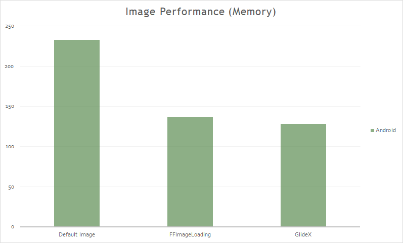

# Xamarin.Forms Performance Playground

There are many techniques for increasing the **performance** of Xamarin.Forms applications. Collectively these techniques can greatly reduce the amount of work being performed by a CPU, and the amount of memory consumed by an application. This repository describes and discusses these techniques.

_(Work in progress)_

* Bindings
* CollectionView
* Fast Renderers
* HttpClient
* Images
* IoC
* Layouts
* Shell
* Views
* Visual
* XAMLC

### HttpClient

Many mobile applications depend on external data making intensive use of the network. Therefore, we are interested in having the fastest possible response when making HTTP requests.

 Take the approach of using a single **HttpClient** instance per server (**reuse** HttpClient between requests). This will get you better performance.

The results:

This is because will segregate things each server may depend on such as cookies or DefaultRequestHeaders. 

A common mistake working with HttpClient is to download json to a string. The problem is that this creates a string of your entire JSON document needlessly. 

This has two problems:
* Depending on the size of the downloaded file to chain, it will affect more than the necessary time.
* Higher memory consumption.

## Images 

### IoC

### XAMLC

## Copyright and license

Code released under the [MIT license](https://opensource.org/licenses/MIT).